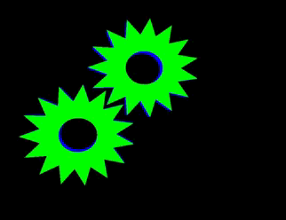

  

 

### `> cat about_me.txt`

- Computer Engineer with a **Master's degree in Artificial Intelligence** from the **Universitat Politècnica de València**.
- Researcher at the **PROS-VRAIN** research group.

### `> ls ~/social`

My social networks, where I explain the projects hosted in my repositories:

 
